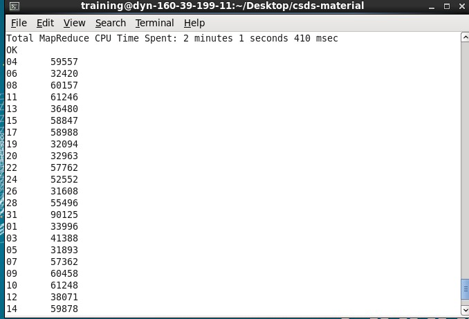
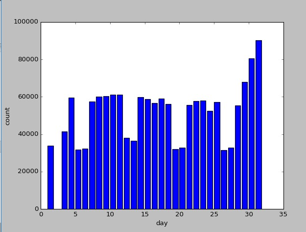

# Log-Analysis-with-Hadoop-and-Hive
We saw and learned how to work with actual big data. In this assignment, we wrote our own MapReduce programs to perform more sophisticated tasks. Further we have created our own Hive database given the dataset in raw form and run few queries on it.   

### DataSet - Nasa Server Logs

**File Name** - server-logs.gz

**Size** - The total size of the dataset is roughly 1GB after uncompressing the .gz file. 

**Description** - The given data set contains Apache Logs gathered by NASA's server in the months of July-October, 1995.

The logs follow the standard [Apache log](https://httpd.apache.org/docs/2.4/logs.html#accesslog) format whereby each line denotes one request.

- Source IP 
- Timestamp 
- HTTP Method
- Request URL
- HTTP Protocol
- Status Code 
- Response Bytes

```
129.188.154.200 - - [01/Jul/1995:00:03:14 -0400] "GET /images/launchpalms-small.gif HTTP/1.0" 200 11473
```

Download and uncompress the dataset from [Google Drive](https://drive.google.com/open?id=0B6qnKGQsJnFfWG02N2loUVluck0). Go through the dataset to get a good idea of all the data and fields present. 

#### Part a : Hive (Further output in Parta file)

1. Create a schema for the dataset in Hive. I have created a concrete structure describing all the required fields.   


2. Find the number of 200 status code in the response in the month of August. 

3. Find the number of unique source IPs that have made requests to the NASA server for the month of September. 

4. Which was the most requested URL in the year 1995.  


5. Make a histogram depicting the number of requests made in a day for every day in the month of October.   


#### Part b : MapReduce (Further output in Partb file)

To solve each of the tasks below, we would need to write your own mapper and reducer.

1. Enumerate all [HTTP status codes](https://en.wikipedia.org/wiki/List_of_HTTP_status_codes) and give counts of each 

  **Output sample:**
  200 - 9301566   
  302 - 219210  
  304 - 800316    
  400 - 45    
  
2. Find the total bandwidth that was sent by the Nasa webserver in the month of July 1995. 

 To calculate total bandwidth add all the response bytes sent by NASA webserver. NASA webservers have domain name ending with  nasa.gov.  Write a MapReduce job that will calculate total bandwidth and print it on STDOUT.
 

